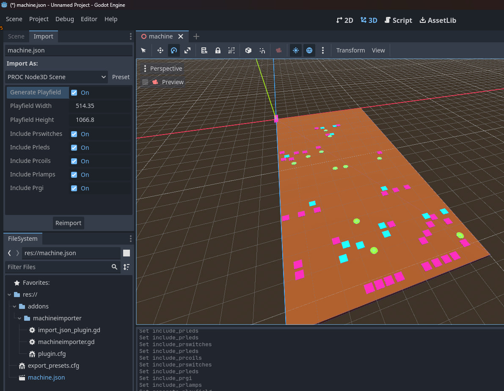
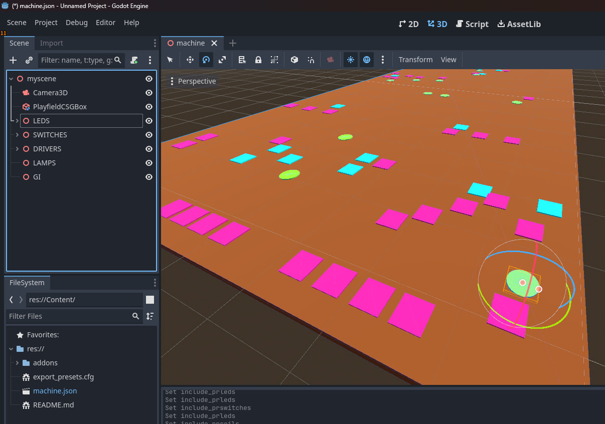

# PROC Machine Import
This is a Godot addons import plug-in.
This allows you to import machine items from a `machine.json` into a 3D test scene.
## Quick Start
- Install the addon by copying the addons folder or installing by `.zip` in the asset library
- Enable the plug-in in the `Project Settings`
- Select a valid `PROC` machine.json file in the godot file window
- Click the `Import` tab (shown in screenshot) with your options
- Click `Reimport` for the plugin to create nodes
- You can double click the `machine.json`.
This will give you the option to create a new scene or just open as it is.
## Tips
- With a the 3D scene open you can have the import Tab open.
Makes changes to the options (or the json) and ReImport with the live changes
- The `machine.json` provided as an example is generated from tools, [NetPinProc.Game.Server](https://github.com/FlippingFlips/NetPinProc/tree/main/Tools/NetPinProc.Game.Server).
This export includes machine item positions, `XPos, YPos`.

